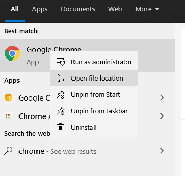
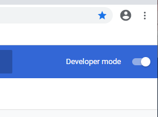
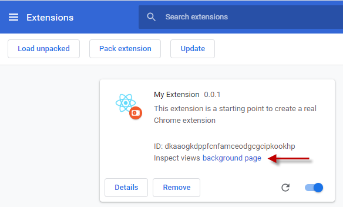
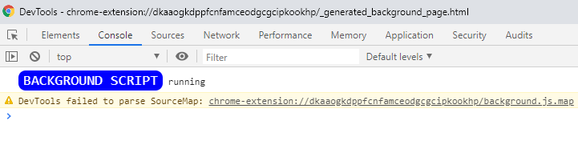
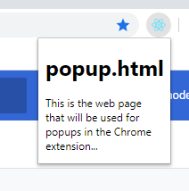

## Installing in Chrome

First off, I like to test my extensions with a separate chrome profile and a 
shortcut that points to it.  This way I don't mess up my existing chrome
profiles.  To setup a new shortcut to a separate profile:

1. Find a shortcut to chrome, I usually use the window key and type 'chrome'
to bring it up.
2. Right-click on that icon and select 'Open File Location'  
    
3. This will bring up the folder where the shortcut link is.  Right-click on it and copy it,
then paste it to your desktop and rename it if you wish.  I like 'Chrome - Extension Dev'.
4. Now right-click on your copy and select 'Properties'
5. The target will have the path to the exe enclosed in double quotes.  Add a `--user-data-dir`
argument pointing to a place to store your profile.  I think chrome will create the directory
if it doesn't exist the first time you use the shortcut.  

Now that shortcut will point to a separate profile you can use for extension testing.
You can open up the extensions page by either typing in `chrome://extensions/` in the
address bar or going to to 'More tools -> Extensions' from the chrome menu.
I like to bookmark this on the bookmark bar right away and also change the setting to
always show the bookmark bar for easy access.  I also remove all the default extensions
added for handling google docs.

To load your extension, flip the 'Developer mode' toggle in the top-right:

Now click 'Load unpacked', navigate to your 'dist' directory, and click 'Select Folder'.
If all goes well:

* If you click on 'Inspect background page' it should open a devtools window and you should
the console log from `src/background.js` displayed:

* You should now see a react icon right of the address bar.  If you 
click on it, you should see the popup page rendered.

* Clicking on the link in the popup will open a new tab with 'index.html' displayed.  The
id in the address is the chrome extension id.

