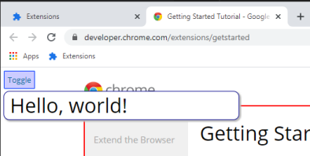

## Content Script

I've included a sample content script.  All it does is inject into pages
at `developer.chrome.com`, putting a red border around the main content
and displaying a button in the top-left that you can click to toggle
the display of another div:



Adding a content script is pretty easy.  For declared scripts in the manifest,
you just the scripts and/or css in the manifest as you would anyway:

```json
"content_scripts": [
    {
    "matches": ["https://developer.chrome.com/*"],
    "js": ["ContentScripts/ChromeDeveloper/index.js"],
    "css": ["ContentScripts/ChromeDeveloper/index.scss"]
    }
]
```

The code file creates a container div using the extension's id as
the element id, adds a class to it, and renders a react component
in it:

```
import React from "react";
import ReactDOM from "react-dom";
import App from "./App";

const id = `content-${chrome.runtime.id}`;
if (!document.getElementById(id)) {
    let div = document.createElement("div");
    div.setAttribute("id", id);
    div.classList.add('content-script-host');
    document.body.prepend(div);
}
ReactDOM.render(<App />, document.getElementById(id));
```

The css is actually compiled from scss using sass (`yarn add sass` was used).
This is done by ParcelJS automatically, how sweet it is!  Here's a snippet,
or you can see [the actual source](../src/ContentScripts/ChromeDeveloper/index.scss):

```scss
// this is a separate CSS so it can change the styles on the page
main#gc-pagecontent {
    border: solid 2px red;
}

div.content-script-host {
    background-color: white;
    border: solic 1px transparent;
    position: absolute;
    top: 0;
    left: 0;
    z-index: 1000;
```